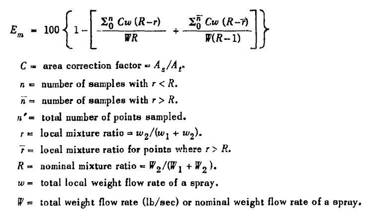
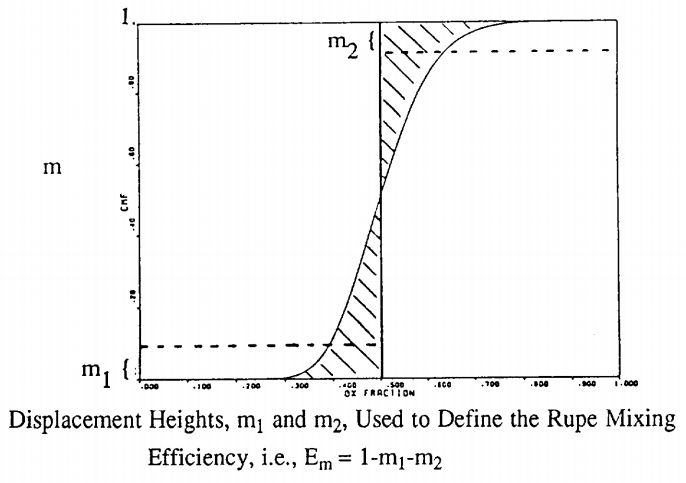

.. chamber_eff

Chamber Efficiencies
====================

Mixing Efficiency
-----------------

**RocketIsp** considers two types of mixing efficiency, 
the mixing between adjacent elements (Mixing Angle) and 
the mixing within a given injector element (Rupe :math:`E_m`).
In **RocketIsp** those two types are handled by a mixing angle model and a Rupe :math:`E_m` model.

Both mixing models require the use of an :ref:`Injector model <ref_to_Injector>` 
in order to characterize the injector face and the individual elements.

Mixing Angle
~~~~~~~~~~~~

The adjacent element mixing efficiency model is based on the "Mixing Angle", defined as the 
angle between injector face elements as measured from the throat plane.
(Note that the angle is measured from edge-to-edge of each element, not center-to-center)

Historically, thrusters with a mixing angle of 2 degrees has about a 99% mixing efficiency.

This observation, known as the "Two Degree Rule", is the basis for the simple scaling
equation used by **RocketIsp** to approximate the mixing efficiency.

The equation below shows how the "Two Degree Rule" is used in a simple scaling equation
for :math:`\eta_{mix}`.
Once the angle between the elements is determined (:math:`\alpha_{deg}`) in degrees, 
the mixing efficiency is:

:math:`\Large{\eta_{mix} = 1 - 0.01 * ( \alpha_{deg} / 2 )^2}`

The chart below shows a typical inter-element mixing loss, as calculated by the
"Two Degree Rule" used in **RocketIsp**. 

.. image:: ./_static/mixing_eff.png
    :width: 49%

Notice that the chart uses "element density",
defined as the total number of elements divided by the injector face area::

    elemDens = Nelements / Ainj
    
    where:
        Nelements = number of elements on injector face
        Ainj = injector face area (in**2)
        elemDens = element density (elements / in**2)

Rupe :math:`E_m`
~~~~~~~~~~~~~~~~

In 1953, Rupe published the paper
`The Liquid-Phase Mixing of a Pair of Impinging Streams <https://apps.dtic.mil/sti/citations/AD0028860>`_
that measured the effectiveness of mixing in a pair of impinging streams.
The mixing factor, :math:`E_m`, was evaluated experimentally on the basis of local mixture ratios
at different radial angle and distance from the impingement element.

In this original paper, :math:`E_m` ranged from 0 to 100 as described by the equation below.
When :math:`E_m` is 0, the propellants are totally unmixed, when :math:`E_m` is 100 the propellants are perfectly mixed.
(NOTE: In recent times, :math:`E_m` is usually expressed as a fraction from 0.0 to 1.0
and sometimes referred to as the mixing efficiency, :math:`\eta_m`)

Rupe typically found maximum values of :math:`E_m` between 75 and 85 (0.75 to 0.85 as :math:`\eta_m`)

In 1993, the final report
`Additional support for the TDK/MABL computer program <https://ntrs.nasa.gov/citations/19930019839>`_
discusses possible approaches to using :math:`E_m` in performance calculations.
The chart below, Figure 4 from appendix C, suggests the use of a cumulative mass fraction distribution chart
as a way to characterize average high and low oxidizer mass fraction (i.e. mixture ratio)
as a function of :math:`E_m`.

This idea of an average high and low mixture ratio, each a function of :math:`E_m`,
is used in **RocketIsp** to calculate the Isp efficiency :math:`\large{\eta_{E_m}}`.
The approach is defined in the
`User's manual for rocket combustor interactive design (ROCCID) and analysis computer program <https://ntrs.nasa.gov/citations/19910014917>`_
in section 2.2, STEADY STATE COMBUSTION ITERATION (SSCI).

Equations 2.4a and 2.4b from ROCCID (equations below) calculate average high and low mixture ratios as well
as high and low stream tube mass fractions.

.. image:: ./_static/ROCCID_MRhi_MRlo.jpg

Based on these ROCCID equations, **RocketIsp** calculates :math:`\eta_{E_m}` as 

.. code-block:: python

    mrLow = MRcore * Em
    mrHi  = MRcore / Em
    
    IspLow  = calcIsp( mrLow )
    IspHi   = calcIsp( mrHi  )
    IspCore = calcIsp( MRcore )
                                  
    xm1 = (1.0 + mrLow) / (1.0 + Em) / (1.0 + MRcore)
    xm2 = 1.0 - xm1
    
    effEm = (xm1*IspLow + xm2*IspHi) / IspCore

or

:math:`\Large{\eta_{E_m} = (xm1*IspLow + xm2*IspHi) / IspCore}`

.. note::

    :math:`E_m` is an input to RocketIsp.
    For preliminary design purposes, think of mixing factor, :math:`E_m`, as:
    
    Em = 0.7    Below average injector
    
    Em = 0.8    Average injector
    
    Em = 0.9    Above average injector

Vaporization Efficiency
-----------------------

The vaporization efficiency model in **RocketIsp** is based on the report
`Propellant Vaporization as a Design Criterion for Rocket-Engine Combustion Chambers
<https://www.google.com/books/edition/Propellant_Vaporization_as_a_Design_Crit/Jt4QAQAAIAAJ?hl=en&gbpv=1>`_
by Richard J. Priem and Marcus F. Heidmann.

The model calculates the vaporized fraction of both the oxidizer and fuel
by using the following equation for the generalized vaporization length (Lgen)
and the chart below it to look up their vaporized fractions.
(see document for definition of terms in Lgen equation)

.. image:: ./_static/Lgen_equation.jpg

.. image:: ./_static/lgen_chart.jpg

Once the vaporized fractions of ox and fuel are available, use them to calculate
the Isp vaporization efficiency :math:`\large{\eta_{vap}}`
as the fraction of total propellant vaporized times the ratio of (Isp at vaporized MR)
to (Isp at core MR).

:math:`\huge{ \eta_{vap} = \frac { f_{vap} * IspODE_{MRvap}} {IspODE_{MRcore}} }`

In python code...

.. code-block:: python

        
        # get vaporized MR
        mrVap = MRcore * fracVapOx / fracVapFuel
        
        # get total vaporized propellant fraction
        fracVapTot = (fracVapOx*wdotOx + fracVapFuel*wdotFl) / wdotTot
        
        # calc vaporization efficiency
        vapIsp = get_Isp( MR=mrVap )
        effVap = fracVapTot * vapIsp / IspODE

Fuel Film Cooling
-----------------

Estimating the performance loss due to fuel film cooling (FFC) boils down to estimating the amount of 
core stream tube combustion gas that is entrained into the barrier stream tube.

The model for calculating the entrained core gases, 
comes from `Combustion effects on film cooling, NASA-CR-135052 <https://ntrs.nasa.gov/citations/19770014416>`_.
That model assumes two stream tubes, as shown in the illustration below, and uses the input, ko (typical range from 0.03 to 0.06)
as the main input affecting entrainment.

As a general first estimate of ko, the default value of 0.035 is a good starting point.
Note that `Combustion effects on film cooling, NASA-CR-135052 <https://ntrs.nasa.gov/citations/19770014416>`_
recommends using test data to determine the best value.

.. image:: ./_static/entrained_ffc.jpg

Pulsing Efficiency
------------------

One of the options for the **RocketThruster** is to run the engine in short pulses.
The two inputs to the thruster that control the pulsing efficiency are: **pulse_sec** and **pulse_quality** 
(:ref:`see RocketThruster definitions <ref_to_RocketThruster>`).

The :math:`\eta_{pulse}` model is just a rough approximation based on the curves below.

Engine design features like dribble volume or ox/fuel lead/lag will impact pulsing performance, however,
the shape of the pulsing efficiency will probably look similar to the chart below. (Note that the vehicle's
tank mixture ratio can shift dramatically from the steady state MR if a lot of the duty cycle involves pulsing.)

The chart reflects some historical data where a **pulse_quality** of 0 is fairly poor and a
**pulse_quality** of 1 is fairly good.

.. image:: ./_static/pulse_eff_range.png
