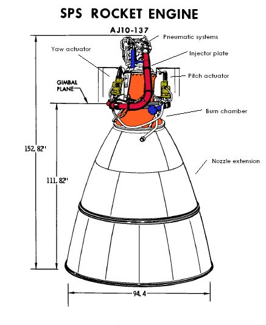

.. examples

Examples
========

**Rocketisp** uses a simplified :ref:`JANNAF Standard <ref_to_jannaf_standard>` approach to calculate delivered
specific impulse (Isp) for liquid rocket thrust chambers.

The following examples taken from 
`Space Engine Encyclopedia <https://www.alternatewars.com/BBOW/Space_Engines/Space_Engine_Encyclopedia.htm>`_ 
demonstrate how to use **Rocketisp**.

Apollo SPS 
----------

`Aerojet AJ10-137 (Apollo Service Module Engine) <https://ntrs.nasa.gov/search.jsp?R=20100027319>`_
part of the `AJ10 <https://en.wikipedia.org/wiki/AJ10>`_ line of Aerojet engines.

The Apollo SPS engine was used to power the 
`Apollo command and service module <https://en.wikipedia.org/wiki/Apollo_command_and_service_module#:~:text=%20Apollo%20command%20and%20service%20module%20%201,inches%20%283.23...%204%20See%20also.%20%20More%20>`_

The SPS engine was used to place the Apollo spacecraft into and out of lunar orbit, 
and for mid-course corrections between the Earth and Moon. 
It also served as a retrorocket to perform the deorbit burn for Earth orbital Apollo flights.

Based on the 
`Apollo BlockII SPS Engine Testing <https://www.semanticscholar.org/paper/BLOCK-II-AJ10-137-APOLLO-SERVICE-MODULE-ENGINE-AT-DeFord-McIlveen/c970eff6d329ba0a9d686f7f28feb6b2dc012e71>`_,
the performance of the engine was about 314 sec at 100 psia chamber pressure.

With a guess of 15% for fuel film cooling, 
the **RocketIsp** model below predicts a delivered Isp of 313.2 seconds.

Note that the operating core mixture ratio was calculated based on maximizing the delivered Isp
by using the method *set_mr_to_max_ispdel*.

.. image:: ./_static/Apollo_SPS_Isp_curves.jpg
    :width: 49%

.. literalinclude:: ./_static/example_scripts/Apollo_SPS.py

The resulting summary print is

.. literalinclude:: ./_static/example_scripts/Apollo_SPS.out

R-4D Optimum MR
---------------

As an exercise in finding the optimum mixture ratio at which to operate a thruster, 
use the `Aerojet HiPAT R-4D Engine <https://www.rocket.com/sites/default/files/documents/In-Space%20Data%20Sheets%204.8.20.pdf>`_
shown below, as an example.

The R-4D was originally developed for the reaction control systems for the Apollo Service Module and 
Lunar Excursion Module. 
The HiPAT is the fifth generation of the R-4D 100 lbf thrust class of liquid bipropellant engines.
It performs orbit-raising maneuvers for many of the world's communication satellite platforms, 
including Astrium's Eurostar 3000, Boeing Space Systems' 702HP, MELCO's DS-2000 and Loral's LS-1300. 
The R-4D also has played critical roles in NASA missions such as Cassini's orbit insertion of Saturn.

.. image:: ./_static/HiPAT_NTO_N2H4_100lbf_diag_v2.jpg

According to the
`High Pressure Bipropellant Engine System Study <https://vdocuments.net/american-institute-of-aeronautics-and-astronautics-42nd-aiaaasmesaeasee-5853e818b5e97.html>`_
the Aerojet HiPAT R-4D engine uses 30% fuel film cooling (FFC) and operates at a mixture ratio of 0.85 
(Note that a newer version of the R-4D has been developed that operates at a nominal 1.0 mixture ratio, so presumably less FFC)

The objective of this exercise is to model a 100 lbf N2O4/N2H4 engine with 30% FFC, a large 375:1 nozzle expansion ratio 
and discover the mixture ratio for maximizing delivered vacuum Isp.

The following code sets up a model of the 
`Aerojet HiPAT R-4D Engine <https://www.rocket.com/sites/default/files/documents/In-Space%20Data%20Sheets%204.8.20.pdf>`_
and iterates through a range of core stream-tube mixture ratios. **RocketIsp** will calculate the overall thruster mixture
ratio and delivered Isp.

Because we know little of the internal thruster geometry,
the method **scale_Rt_to_Thrust** will set the vacuum thrust to 100 lbf at each iteration.
The only specific geometry parameter is the nozzle area ratio of 375:1.
The rest of the geometry is left to scale "appropriately".

.. literalinclude:: ./_static/example_scripts/plot_opt_mr.py

The above script results in the following chart. 

Notice that despite the maximum IspODE mixture ratio for the core optimizing at above 1.4,
and the maximum IspODK mixture ratio at about 1.2,
the maximum Isp MR for the R-4D with 30% FFC is right about at its published operating point of 0.85
(**RocketIsp** predicts a maximum at 0.88, although the peak is pretty flat.)

.. image:: ./_static/HiPAT_NTO_N2H4_IspDel.png

The published IspDel for the 375:1 nozzle is 329. The above **RocketIsp** chart shows just over 325... about a 1% difference.

The output below shows the thruster efficiencies calculated by **RocketIsp** at the IspDel MR peak of 0.88.
The overall Isp efficiency is 92.6% including the assumed chamber efficiency of 99%.
The 1% Isp difference could perhaps be accounted for with more sophisticated analysis of the 
individual efficiencies.

.. literalinclude:: ./_static/example_scripts/hipat_at_opt_mr.out

