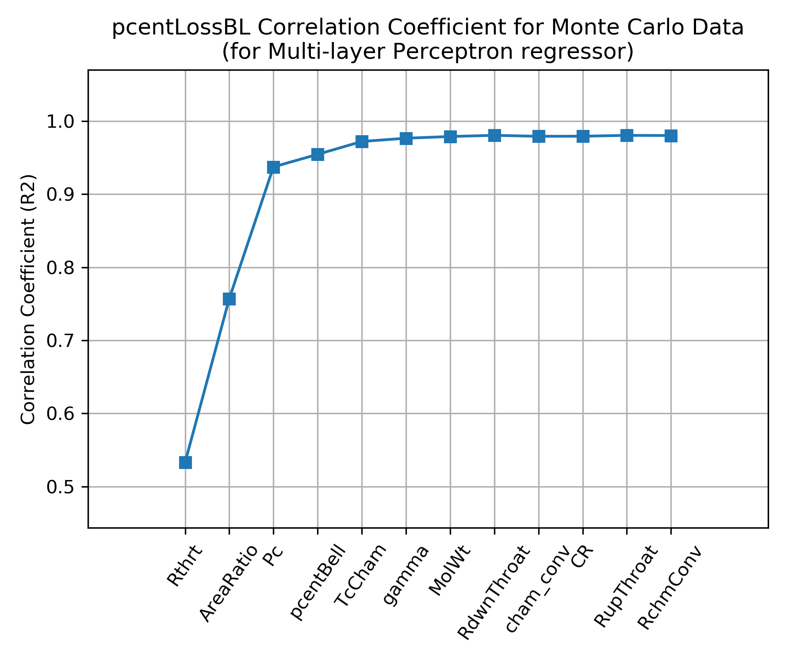
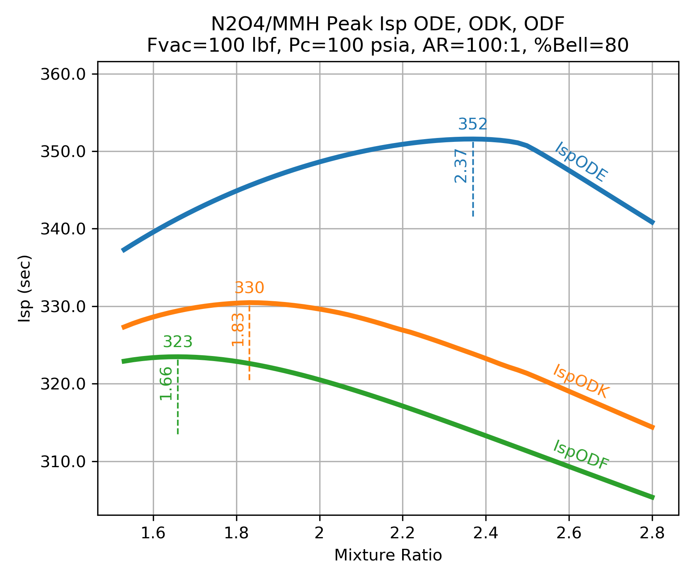
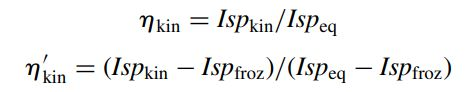

.. nozzle_eff

Nozzle Efficiencies
===================

Boundary Layer Loss
-------------------

The boundary layer loss is a result of not only the friction and heat transfer with the combustor wall,
but also the change those forces make in the **aerodynamic geometry** as opposed to the **physical geometry**.
In other words, the flow area of the throat and nozzle exit is less than the physical dimensions of the hardware
due to the formation of a boundary layer.

In general the **aerodynamic area ratio** will be less than the **physical area ratio**.
That area ratio reduction will account for a large fraction of the overall boundary layer loss
since smaller area ratios tend to have lower ideal Isp.

In `RocketIsp <http://rocketisp.readthedocs.org/en/latest/>`_ , 
one source for the boundary layer loss correlation is 
`NASA SP 8120 <https://ntrs.nasa.gov/search.jsp?R=19770009165>`_. Figure 4 of that document
(shown below) displays a correlation of boundary layer loss over a range of area ratio, chamber pressure
and throat diameter. 
A curve fit of Figure 4 from `NASA SP 8120 <https://ntrs.nasa.gov/search.jsp?R=19770009165>`_
is displayed as an efficiency in the right-hand plot.
(Figure 4 curves were digitized using `Digiplot <https://digiplot.readthedocs.io/en/latest/>`_.)

Because `NASA SP 8120 <https://ntrs.nasa.gov/search.jsp?R=19770009165>`_ 
correlated loss as a percentage of nozzle thrust, the multiplier form of effBL (:math:`\large{\eta_{BL}}`) in the 
:math:`Isp_{del}`
equation should be used with this correlation.

.. raw:: html

    <table width="100%">
    <tr>
    <th style="text-align:center;"> NASA SP 8120 Loss </th>
    <th style="text-align:center;"> Curve Fit SP 8120 </th>
    </tr>
    <tr>
    <td width="50%">
    
    </td>
    <td>
    
    </td>
    </tr>
    <tr>
    <td colspan="2" style="text-align:center;">
    
<cite>Click image to see full size</cite>

    </td>
    </tr>
    </table>
    

Bear in mind that while the above correlation is qualitatively correct, it does not carry the accuracy
of a more full analysis. The most accurate estimate would come from a rigorous analysis of the 
thin gas layer along the wall of the nozzle. The results would include the effects of the gas
thermodynamic and transport properties as well as the nozzle shape, surface roughness and temperature.
Such an analysis is conducted in the next section for 
:ref:`Monte Carlo Boundary Layer Analysis <ref_to_bl_monte_carlo>`.

As is evident in the above graphs, the boundary layer efficiency improves with increasing chamber pressure
and increasing throat diameter. The loss worsens with increasing area ratio.

.. _ref_to_bl_monte_carlo:

:math:`\eta_{BL}` Monte Carlo
~~~~~~~~~~~~~~~~~~~~~~~~~~~~~

In order to more fully characterize the variation in :math:`\eta_{BL}` and identify any additional influencing parameters, a
`Monte Carlo <https://en.wikipedia.org/wiki/Monte_Carlo_method>`_ analysis was conducted
on a wide range of propellant combinations, chamber pressures and thrust chamber geometries. Many thousands of boundary layer
analyses were run in order to identify boundary layer influences.
:math:`\eta_{BL}` was then fitted with a :ref:`Multi-layer Perceptron regressor <ref_to_mlp_summary>`.

The independent parameters in the `Monte Carlo <https://en.wikipedia.org/wiki/Monte_Carlo_method>`_ analysis 
are shown across the x axis of the chart below. The y axis shows the correlation coefficient that results from 
fitting :math:`\eta_{BL}` with a :ref:`Multi-layer Perceptron regressor <ref_to_mlp_summary>`
when selecting, one by one, the best scoring independent parameter to add next.

The chart shows that the :math:`\eta_{BL}` is well characterized by using three independent parameters, throat radius (Rthrt), 
area ratio (eps) and chamber pressure (Pc); the same three parameters that appear in 
`NASA SP 8120 <https://ntrs.nasa.gov/search.jsp?R=19770009165>`_ .

Some small gains in correlation coefficient can be attained by adding
percent bell (pcentBell) and chamber temperature (TcCham) as independent parameters.

`Click Image to View Fill Size`

A comparison of :math:`\eta_{BL}` as predicted by the `NASA SP 8120 Report <https://ntrs.nasa.gov/search.jsp?R=19770009165>`_  
to :math:`\eta_{BL}` predicted by the
:ref:`Multi-layer Perceptron regressor <ref_to_mlp_summary>`
are shown below. Both models predict that :math:`\eta_{BL}` improves for higher chamber pressure, larger
throat diameter and smaller area ratio.

Notice that `NASA SP 8120 Report <https://ntrs.nasa.gov/search.jsp?R=19770009165>`_ predicts about twice as much
boundary layer loss as the 
:ref:`Multi-layer Perceptron regressor <ref_to_mlp_summary>`.

Because the `NASA SP 8120 Report <https://ntrs.nasa.gov/search.jsp?R=19770009165>`_ uses the product of 
chamber pressure and throat diameter as an independent variable, that correlation can not predict :math:`\eta_{BL}`
beyond about a 1 inch throat radius at 1000 psia chamber pressure.

The
:ref:`Multi-layer Perceptron regressor <ref_to_mlp_summary>`
model was selected as the default boundary layer loss model in **RocketIsp** because it covers a wider range of cases and
it is based on a more recent understanding of :math:`\eta_{BL}` as modeled by thousands of detailed computer analyses.

.. raw:: html

    <table width="100%">
    <tr>
    <th style="text-align:center;"> Pc=100 psia </th>
    <th style="text-align:center;"> Pc=1000 psia </th>
    </tr>
    <tr>
    <td width="50%">
    
    </td>
    <td>
    
    </td>
    </tr>
    <tr>
    <td colspan="2" style="text-align:center;">
    
<cite>Click image to see full size</cite>

    </td>
    </tr>
    </table>

Divergence Efficiency
---------------------

The divergence efficiency (:math:`\large{\eta_{div}}`) represents the difference in performance between one-dimensional 
and axisymmetric two-dimensional flow. 

The divergence efficiency correlation shown below-left
was created by taking the results of 6 common
propellant combinations and analyzing them with the
`TDK <http://www.seainc.com/productsTDK.php>`_ computer program.

`TDK <http://www.seainc.com/productsTDK.php>`_  calculated boundary layer properties and 
assumed some nominal operating conditions with a nominal chamber and throat geometry.
A large range of area ratio was use, each run employed the **NCO** option that
finds the optimum entrance and exit angles for a 
`skewed parabolic nozzle <http://www.aspirespace.org.uk/downloads/Thrust%20optimised%20parabolic%20nozzle.pdf>`_.  
The efficiency correlation
therefore assumes that the best possible parabolic nozzle is being used.
(This data is from 2006 and I believe, the version of `TDK <http://www.seainc.com/productsTDK.php>`_ used for this was 
the 2004 version.)

The chart below-right is from 
:ref:`CPIA 246 JANNAF Rocket Engine Performance Prediction and Evaluation Manual <ref_to_cpia_246>`
It shows very similar results as the `TDK <http://www.seainc.com/productsTDK.php>`_ output, however,
it is clear from the `TDK <http://www.seainc.com/productsTDK.php>`_
results that some boundary layer and/or combustion gas properties can affect the divergence loss by about 10%.
In other words, 10% of :math:`(1.0-\large{\eta_{div}})`

.. raw:: html

    <table width="100%">
    <tr>
    <th style="text-align:center;"> TDK Runs </th>
    <th style="text-align:center;"> CPIA 246 </th>
    </tr>
    <tr>
    <td width="60%">
    
    </td>
    <td>
    
    </td>
    </tr>
    <tr>
    <td colspan="2" style="text-align:center;">
    
<cite>Click image to see full size</cite>

    </td>
    </tr>
    </table>

:math:`\eta_{div}` Monte Carlo
~~~~~~~~~~~~~~~~~~~~~~~~~~~~~~

The above correlation assumed some nominal operating conditions with a nominal chamber and throat geometry.
In order to more fully characterize the variation in :math:`\eta_{div}` and identify any additional influencing parameters, a
`Monte Carlo <https://en.wikipedia.org/wiki/Monte_Carlo_method>`_ analysis was conducted
on a wide range of propellant combinations, chamber pressures and thrust chamber geometries. Many thousands of boundary layer
analyses were run in order to include operating points and geometry influences on :math:`\eta_{div}`.
:math:`\eta_{div}` was then fitted with a :ref:`Multi-layer Perceptron regressor <ref_to_mlp_summary>`.

The independent parameters in the `Monte Carlo <https://en.wikipedia.org/wiki/Monte_Carlo_method>`_ analysis 
are shown across the x axis of the chart below. The y axis shows the correlation coefficient that results from 
fitting :math:`\eta_{div}` with a :ref:`Multi-layer Perceptron regressor <ref_to_mlp_summary>`
when selecting, one by one, the best scoring independent parameter to add next.

The chart shows that :math:`\eta_{div}` is mostly dependent on only two independent parameters, percent bell (pcentBell), 
and area ratio (AreaRatio); the same two parameters that appear above in 
:ref:`CPIA 246 JANNAF Rocket Engine Performance Prediction and Evaluation Manual <ref_to_cpia_246>`.

About 10% improvement in correlation coefficient can be attained by adding
downstream radius of curvature (RdwnThroat), throat radius (Rthrt),
combustion temperature (TcCham), chamber pressure (Pc), molecular weight (MolWt) 
and ratio of specific heats (gamma) as independent parameters.

.. image:: ./_static/pcentlossdiv_corr_params.png
    :width: 49%
    
`Click Image to View Fill Size`

Below are two charts showing how :math:`\eta_{div}` varies as a result of downstream radius of curvature (RdwnThroat)
and throat radius (Rthrt). As the correlation coefficient indicated, RdwnThroat variation has more impact than Rthrt variation.

The charts below indicate that RdwnThroat has more impact at low area ratio, and Rthrt has more impact at high area ratio.

.. raw:: html

    <table width="100%">
    <tr>
    <th style="text-align:center;"> RdwnThroat Sensitivity </th>
    <th style="text-align:center;"> Rthrt Sensitivity </th>
    </tr>
    <tr>
    <td width="50%">
    
    </td>
    <td>
    
    </td>
    </tr>
    <tr>
    <td colspan="2" style="text-align:center;">
    
<cite>Click image to see full size</cite>

    </td>
    </tr>
    </table>

Two Phase Efficiency
--------------------

Two phase flow loss is a result of the thermal and velocity lag between the expanding gas and particles of
either liquid or solid.

There is currently no model in **RocketIsp** to predict two phase efficiency, however, :math:`eta_{TP}` can
be input and accounted for if the user has appropriate data available.

Kinetic Efficiency
------------------

Kinetic efficiency is a result of finite reaction rates in the nozzle.

The `NASA CEA code <https://www.grc.nasa.gov/WWW/CEAWeb/ceaHome.htm>`_ 
used by `RocketCEA <http://rocketcea.readthedocs.org/en/latest/>`_ 
and **RocketIsp** is a one dimensional equilibrium (ODE) code.
It calculates temperature, pressure and species concentrations based on a one dimensional flow model
where all molecular species are kept at chemical equilibrium (ODE).

While equilibrium is the most common mode in which to run `CEA <https://www.grc.nasa.gov/WWW/CEAWeb/ceaHome.htm>`_  
(and `RocketCEA <http://rocketcea.readthedocs.org/en/latest/>`_ ),
both can also be run assuming that the molecular species concentrations are held 
constant (frozen) from the combustion chamber to the nozzle exit.

Real rocket engines operate somewhere between frozen(ODF) and equilibrium(ODE).
This is because chemical reactions take a finite amount of time to reach equilibrium.
Given no time, the species are frozen, given infinite time the species reach equilibrium.

Because frozen Isp, :math:`Isp_{ODF}`, is lower than equilibrium Isp, :math:`Isp_{ODE}`, 
there is a loss associated with nozzle kinetics.
Kinetics loss is typically in the range of 0.1 to 10% of Isp.

Chemical equilibrium is aided by high temperature and pressure (faster reactions/more molecular collisions) 
and species residence time (rocket engine's physical size).
An infinitely small engine has frozen chemistry.
An infinitely large engine has equilibrium chemistry.

This also means that real rocket engines will typically
have maximum Isp at a mixture ratio(MR) somewhere between the frozen peak MR and the equilibrium peak MR.
The figure below shows this kinetics efficiency impact on MR for a small, low pressure N2O4/MMH thruster.

.. _ref_to_kinetics_groups:

Kinetics Groups
~~~~~~~~~~~~~~~

Chemical kinetics are usually analyzed based on the element components in the combustion products.
For example a LOX/LH2 engine is in group **HO** because is only has Hydrogen and Oxygen.
A LOX/CH4 engine is in group **CHO** for Carbon, Hydrogen and Oxygen.
The table below shows common group names and some propellant combinations belonging to them.

.. raw:: html

    <table><tr> <th>Group</th> <th>Oxidizer</th> <th>Fuels</th> </tr>
        <tr  style="background-color:#DBE4EE"><td rowspan="1" style="font-weight:bold">FH</td>
            <td>F2</td><td>LH2</td></tr>
        <tr  style="background-color:#F5F7FA"><td rowspan="1" style="font-weight:bold">HO</td>
            <td>LOX</td><td>LH2</td></tr>
        <tr  style="background-color:#DBE4EE"><td rowspan="1" style="font-weight:bold">FHN</td>
            <td>F2</td><td>N2H4, NH3</td></tr>
        <tr  style="background-color:#F5F7FA"><td rowspan="1" style="font-weight:bold">CHO</td>
            <td>LOX</td><td>C2H6, CH4, Ethanol, Methanol, Propane, RP1</td></tr>
        <tr  style="background-color:#DBE4EE"><td rowspan="6" style="font-weight:bold">HNO</td>
            <td>LOX</td><td>N2H4, NH3</td></tr>
            <tr  style="background-color:#DBE4EE"><td>MON10</td><td>LH2, N2H4, NH3</td></tr>
            <tr  style="background-color:#DBE4EE"><td>MON25</td><td>LH2, N2H4, NH3</td></tr>
            <tr  style="background-color:#DBE4EE"><td>MON30</td><td>LH2, N2H4, NH3</td></tr>
            <tr  style="background-color:#DBE4EE"><td>N2O</td><td>LH2, N2H4, NH3</td></tr>
            <tr  style="background-color:#DBE4EE"><td>N2O4</td><td>LH2, N2H4, NH3</td></tr>
        <tr  style="background-color:#F5F7FA"><td rowspan="1" style="font-weight:bold">CLFH</td>
            <td>CLF5</td><td>LH2</td></tr>
        <tr  style="background-color:#DBE4EE"><td rowspan="1" style="font-weight:bold">CFHN</td>
            <td>F2</td><td>A50, MHF3, MMH, UDMH</td></tr>
        <tr  style="background-color:#F5F7FA"><td rowspan="1" style="font-weight:bold">CFHO</td>
            <td>F2</td><td>Ethanol, Methanol</td></tr>
        <tr  style="background-color:#DBE4EE"><td rowspan="1" style="font-weight:bold">FHNO</td>
            <td>IRFNA</td><td>LH2, N2H4, NH3</td></tr>
        <tr  style="background-color:#F5F7FA"><td rowspan="6" style="font-weight:bold">CHNO</td>
            <td>LOX</td><td>A50, MHF3, MMH, UDMH</td></tr>
            <tr  style="background-color:#F5F7FA"><td>MON10</td><td>A50, C2H6, CH4, Ethanol, MHF3, MMH, Methanol, Propane, RP1, UDMH</td></tr>
            <tr  style="background-color:#F5F7FA"><td>MON25</td><td>A50, C2H6, CH4, Ethanol, MHF3, MMH, Methanol, Propane, RP1, UDMH</td></tr>
            <tr  style="background-color:#F5F7FA"><td>MON30</td><td>A50, C2H6, CH4, Ethanol, MHF3, MMH, Methanol, Propane, RP1, UDMH</td></tr>
            <tr  style="background-color:#F5F7FA"><td>N2O</td><td>A50, C2H6, CH4, Ethanol, MHF3, MMH, Methanol, Propane, RP1, UDMH</td></tr>
            <tr  style="background-color:#F5F7FA"><td>N2O4</td><td>A50, C2H6, CH4, Ethanol, MHF3, MMH, Methanol, Propane, RP1, UDMH</td></tr>
        <tr  style="background-color:#DBE4EE"><td rowspan="1" style="font-weight:bold">CLFHN</td>
            <td>CLF5</td><td>N2H4, NH3</td></tr>
        <tr  style="background-color:#F5F7FA"><td rowspan="1" style="font-weight:bold">CFHNO</td>
            <td>IRFNA</td><td>A50, C2H6, CH4, Ethanol, MHF3, MMH, Methanol, Propane, RP1, UDMH</td></tr>
        <tr  style="background-color:#DBE4EE"><td rowspan="1" style="font-weight:bold">CCLFHN</td>
            <td>CLF5</td><td>A50, MHF3, MMH, UDMH</td></tr>
    </table>

The kinetic loss for each of the groups is controlled by a list of primary chemical reactions.
A unique list of reactions for each group is listed in
Appendix A of the **TDK** manual
`1985 Engineering and programming manual: Two-dimensional kinetic reference computer program (TDK) <https://ntrs.nasa.gov/citations/19860007470>`_
that contains tables of reactions and their reaction rates for the various element groups.

In the AIAA paper `Nozzle Performance Predictions Using the TDK 97 Code <http://docshare01.docshare.tips/files/24936/249361716.pdf>`_
by Stuart Dunn and Douglas Coats gives suggested chemical reactions for the CHON element group.

.. image:: ./_static/CHON_Reactions.jpg

The **TDK** code is the accepted standard for the `JANNAF <https://www.jannaf.org/>`_ 
performance calculation method.
As far as I know, `JANNAF <https://www.jannaf.org/>`_  only controls a version of 
`TDK from 1993 <https://www.jannaf.org/products/codes>`_
and the only modern versions are the two commercial versions 
`TDK at Software & Engineering Associates <http://www.seainc.com/productsTDK.php>`_
and
`TDK at Sierra Engineering & Software, Inc. <http://sierraengineering.com/TDK/tdk.html>`_

The charts below show typical results from a **TDK**
chemical kinetics calculation. The charts demonstrate the shifting species concentrations for a
LOX/LH2 thruster as a function of area ratio.

Notice how the mass fractions move from the frozen value towards the equilibrium value
and how large throats shift further than small throats.

Notice also that reaction rates near the throat are much higher than at the nozzle exit.

.. raw:: html

    <table width="100%">
    <tr>
    <th style="text-align:center;"> H2O </th>
    <th style="text-align:center;"> OH </th>
    </tr>
    <tr>
    <td width="50%">
    
    </td>
    <td>
    
    </td>
    </tr>
    <tr>
    <td colspan="2" style="text-align:center;">
    
<cite>Click image to see full size</cite>

    </td>
    </tr>
    </table>

.. _ref_to_fracKin_def:

fracKin
~~~~~~~

In the AIAA paper `Nozzle Performance Predictions Using the TDK 97 Code <http://docshare01.docshare.tips/files/24936/249361716.pdf>`_
by Stuart Dunn and Douglas Coats or
the publication, `Liquid Rocket Thrust Chambers <https://arc.aiaa.org/doi/book/10.2514/4.866760>`_
Chapter 17, *Assessment of Thrust Chamber Performance*, the authors
define the two most common ways to express kinetics loss.

1) The ratio of specific impulse with and without the loss, :math:`\eta_{kin}`

2) The fraction of the difference between equilibrium and frozen flow, :math:`\eta_{kin}^\prime`

The equations for :math:`\eta_{kin}` and  :math:`\eta_{kin}^\prime` are given as

For calculating kinetic loss, **RocketIsp** uses the  :math:`\eta_{kin}^\prime` form, however,
within the code it is called **fracKin**. This name is used to avoid confusion with :math:`\eta_{kin}`.

**fracKin** can be thought of as the fraction of kinetics completion.
A value of 0.0 is frozen, 1.0 is equilibrium.

:math:`\eta_{kin}` Monte Carlo
~~~~~~~~~~~~~~~~~~~~~~~~~~~~~~

In order to characterize the kinetic efficiency, many thousands of one dimensional kinetic (ODK) analyses were run
and the results were fitted with a :ref:`Multi-layer Perceptron regressor <ref_to_mlp_summary>`.

Each :ref:`major species group <ref_to_kinetics_groups>`, created a
:ref:`fracKin <ref_to_fracKin_def>` (aka :math:`\eta_{kin}^\prime`) :ref:`MLP regressor <ref_to_mlp_summary>`

The :ref:`MLP regressor <ref_to_mlp_summary>`
is used to calculate :ref:`fracKin <ref_to_fracKin_def>`,
:ref:`fracKin <ref_to_fracKin_def>` is used to calculate :math:`\eta_{kin}`,
and finally, :math:`\eta_{kin}` is used in the :ref:`full Isp efficiency equation <ref_to_full_efficiency_eqn>`

The table below shows the top six most important parameters in the 
:ref:`MLP regressor <ref_to_mlp_summary>`
used to correlate :ref:`fracKin <ref_to_fracKin_def>` for each element group.
The order of the parameters results from selecting, one by one, 
the independent parameter with the best correlation coefficient to add next.

For most groups, thruster size (Rthrt) is the most important factor in determining kinetic efficiency.

Notice that while propellant mixture ratio (MR) is not used explicitly to correlate :ref:`fracKin <ref_to_fracKin_def>`,
the mass fraction of molecular species is a proxy for MR and allows the same correlation
to be used for all propellant combinations that are members of the group.

.. raw:: html

    <table><tr> <th>Group</th> <th>#1</th> <th>#2</th> <th>#3</th> <th>#4</th> <th>#5</th> <th>#6</th> </tr>
        <tr  style="background-color:#DBE4EE"><td style="font-weight:bold"><a class="reference internal image-reference" href="./_static/FH_fracKin_corr_params_30x30.png">FH</a></td>
            <td>Rthrt</td>
            <td>H2F2</td>
            <td>MolWt</td>
            <td>eps</td>
            <td>*HF</td>
            <td>*H2</td>
        </tr>
        <tr  style="background-color:#F5F7FA"><td style="font-weight:bold"><a class="reference internal image-reference" href="./_static/HO_fracKin_corr_params_30x30.png">HO</a></td>
            <td>Rthrt</td>
            <td>Pc</td>
            <td>*H2</td>
            <td>eps</td>
            <td>HO2</td>
            <td>H2O</td>
        </tr>
        <tr  style="background-color:#DBE4EE"><td style="font-weight:bold"><a class="reference internal image-reference" href="./_static/CHO_fracKin_corr_params_30x30.png">CHO</a></td>
            <td>Rthrt</td>
            <td>COOH</td>
            <td>eps</td>
            <td>*OH</td>
            <td>Pc</td>
            <td>*O2</td>
        </tr>
        <tr  style="background-color:#F5F7FA"><td style="font-weight:bold"><a class="reference internal image-reference" href="./_static/FHN_fracKin_corr_params_30x30.png">FHN</a></td>
            <td>Rthrt</td>
            <td>Pc</td>
            <td>*H2</td>
            <td>eps</td>
            <td>gammaInit</td>
            <td>NH3</td>
        </tr>
        <tr  style="background-color:#DBE4EE"><td style="font-weight:bold"><a class="reference internal image-reference" href="./_static/HNO_fracKin_corr_params_30x30.png">HNO</a></td>
            <td>Rthrt</td>
            <td>Pc</td>
            <td>gammaInit</td>
            <td>eps</td>
            <td>*H2</td>
            <td>TcCham</td>
        </tr>
        <tr  style="background-color:#F5F7FA"><td style="font-weight:bold"><a class="reference internal image-reference" href="./_static/CFHN_fracKin_corr_params_30x30.png">CFHN</a></td>
            <td>Rthrt</td>
            <td>*NH</td>
            <td>eps</td>
            <td>FCN</td>
            <td>Pc</td>
            <td>MolWt</td>
        </tr>
        <tr  style="background-color:#DBE4EE"><td style="font-weight:bold"><a class="reference internal image-reference" href="./_static/CFHO_fracKin_corr_params_30x30.png">CFHO</a></td>
            <td>Rthrt</td>
            <td>Pc</td>
            <td>*CO2</td>
            <td>eps</td>
            <td>*CO</td>
            <td>CH2F</td>
        </tr>
        <tr  style="background-color:#F5F7FA"><td style="font-weight:bold"><a class="reference internal image-reference" href="./_static/CHNO_fracKin_corr_params_30x30.png">CHNO</a></td>
            <td>Rthrt</td>
            <td>TcCham</td>
            <td>Pc</td>
            <td>eps</td>
            <td>*H2</td>
            <td>*OH</td>
        </tr>
        <tr  style="background-color:#DBE4EE"><td style="font-weight:bold"><a class="reference internal image-reference" href="./_static/CLFH_fracKin_corr_params_30x30.png">CLFH</a></td>
            <td>*H2</td>
            <td>Rthrt</td>
            <td>Pc</td>
            <td>eps</td>
            <td>*CL</td>
            <td>*HF</td>
        </tr>
        <tr  style="background-color:#F5F7FA"><td style="font-weight:bold"><a class="reference internal image-reference" href="./_static/FHNO_fracKin_corr_params_30x30.png">FHNO</a></td>
            <td>Rthrt</td>
            <td>Pc</td>
            <td>*HF</td>
            <td>eps</td>
            <td>gammaInit</td>
            <td>*NO</td>
        </tr>
        <tr  style="background-color:#DBE4EE"><td style="font-weight:bold"><a class="reference internal image-reference" href="./_static/CFHNO_fracKin_corr_params_30x30.png">CFHNO</a></td>
            <td>Rthrt</td>
            <td>TcCham</td>
            <td>*O</td>
            <td>eps</td>
            <td>Pc</td>
            <td>gammaInit</td>
        </tr>
        <tr  style="background-color:#F5F7FA"><td style="font-weight:bold"><a class="reference internal image-reference" href="./_static/CLFHN_fracKin_corr_params_30x30.png">CLFHN</a></td>
            <td>*N2</td>
            <td>Rthrt</td>
            <td>eps</td>
            <td>gammaInit</td>
            <td>HCL</td>
            <td>Pc</td>
        </tr>
        <tr  style="background-color:#DBE4EE"><td style="font-weight:bold"><a class="reference internal image-reference" href="./_static/CCLFHN_fracKin_corr_params_30x30.png">CCLFHN</a></td>
            <td>*CL</td>
            <td>eps</td>
            <td>*N2</td>
            <td>Rthrt</td>
            <td>MolWt</td>
            <td>*HF</td>
        </tr>
        <tr  style="background-color:#F5F7FA"><td style="font-weight:bold"><a class="reference internal image-reference" href="./_static/All_fracKin_corr_params_30x30.png">Combined</a></td>
            <td>Rthrt</td>
            <td>TcCham</td>
            <td>Pc</td>
            <td>HCL</td>
            <td>*CO</td>
            <td>eps</td>
        </tr>
        
        <tr>
        <td colspan="7" style="text-align:center;">
        
<cite>Click Group link to view Correlation Coefficient Plot</cite>

        </td>
        </tr>
                
    </table>

.. note::

    Molecules listed in the table above refer to mass fractions of those molecules.
