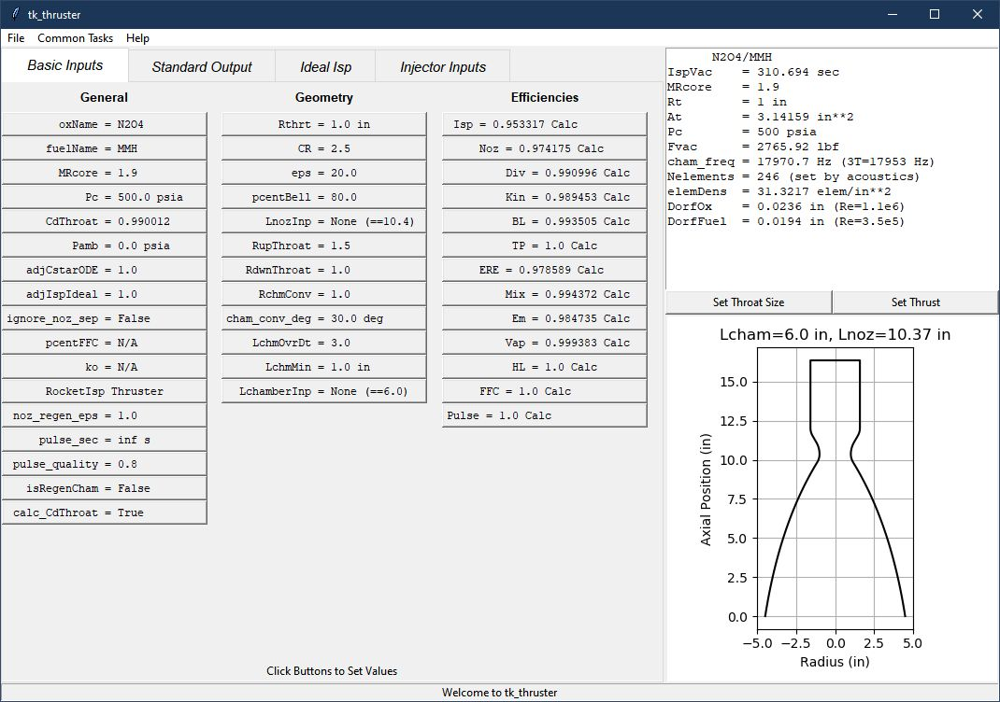

.. quickstart

QuickStart
==========

Install RocketIsp
-----------------

The easiest way to install **Rocketisp** is::

    pip install rocketisp
    
        OR on Linux
    sudo pip install rocketisp
        OR perhaps
    pip install --user rocketisp

.. _internal_source_install:

Installation From Source
------------------------

Much less common, but if installing from source, then
the best way to install rocketisp is still ``pip``.

After navigating to the directory holding **Rocketisp** source code, do the following::

    cd full/path/to/rocketisp
    pip install -e .
    
        OR on Linux
    sudo pip install -e .
        OR perhaps
    pip install --user -e .
    
This will execute the local ``setup.py`` file and insure that the pip-specific commands in ``setup.py`` are run.

Running RocketIsp
-----------------

To test the installation, from the command prompt input the command::

    python -c "from rocketisp.rocket_isp import RocketThruster; RocketThruster().summ_print()"
    
If **Rocketisp** is properly installed, then output similar to the following should result.

.. literalinclude:: ./_static/example_scripts/quick_test.out

RocketIsp GUI
-------------

After installing with ``pip``, there will be a launch command line program called 
**rocketisp** or, on Windows, **rocketisp.exe** placed into your python Scripts subdirectory.

From a terminal or command prompt window simply type::

    rocketisp

and the following tkinter GUI should appear.

If not, then there may be an issue with your system path.
The path for the rocketisp executable might be something like::

    /usr/local/bin/rocketisp             (if installed with sudo pip install -e .)
         or 
    /home/<user>/.local/bin/rocketisp    (if installed with pip install -e .)
         or 
    C:\Python37_64\Scripts\rocketisp.exe    (on Windows)

Make sure your system path includes the above path to **rocketisp**.

